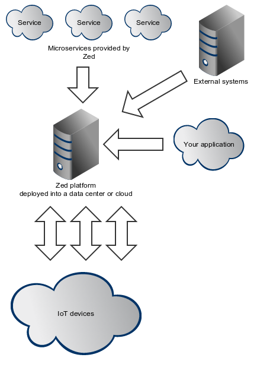

Zed - IoT Backend as a Service (BaaS) platform
===

Zed is **Backend as a Service (BaaS)** platform providing instant **Internet Of Things (IoT)** applications development
enablement.

### Zed architecture

Zed comes with the set of the predefined microservices covering common business requirements of the IoT-enabled
applications. No enterprise system exists in the isolation, so Zed comes with the powerful
[Apache Camel](http://camel.apache.org/) based integration framework to provide smooth integration with the other
enterprise systems.

Armed with base backend services and with the powerful integration framework, your application deployed into the Zed
platform can immediately communicate with the *Internet Of Things*.

### DevOps friendly

The complexity of the IoT world cannot be handled without keeping the highest devOps standards. Zed comes with the
**SSH-compatible shell** and **Maven plugin** to deliver the top devOps experience.

### Red Hat ready

Zed is based on the many of the upstream open-source projects supported by [Red Hat](http://www.redhat.com). If you
need enterprise-level support those components used in Zed - you can buy it from Red Hat.

### Reference documentation

Reference documentation of the project can be found [here](https://github.com/hekonsek/zed/blob/master/docs/reference.MD).

### Build status

